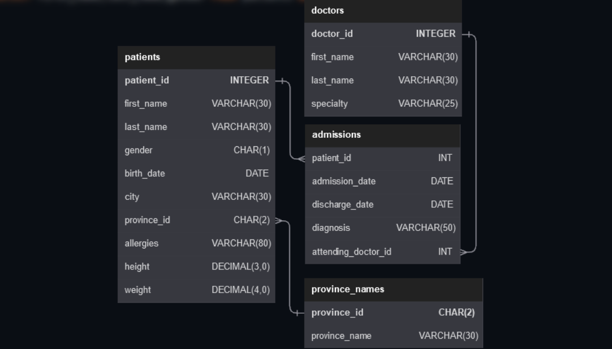

<div align="center">
  
</div>


<p align="left">
  
  
</p>

This folder contains a small set of SQL practice questions written in Markdown. Each file pairs a natural-language question with its SQL query, making it easy to review, study, and reuse.

## What’s Inside

- `01.md` to `20.md` for question-and-query practice entries
- `image/` for supporting assets

## Format

Each markdown file follows the same structure:

````md
# Question

Your SQL question here

# Query

```sql
SELECT ...;
```
````

## Example Topics

- Filtering rows with `WHERE`
- Checking for `NULL` values
- Using `BETWEEN` for ranges
- Updating data with `UPDATE`
- Concatenating text fields

## Notes

- The queries are written in a simple, readable style for learning purposes.
- You can expand this set by adding more numbered `.md` files using the same format.

## Database Layout

This project uses the schema shown below:



The diagram includes the following tables:

- `patients`
- `doctors`
- `admissions`
- `province_names`

